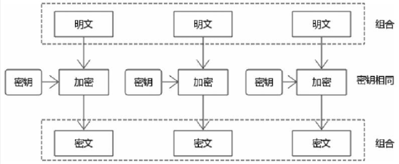
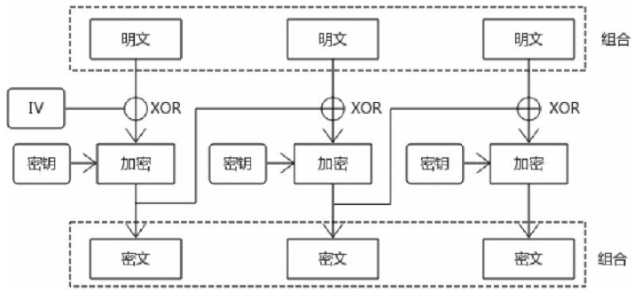
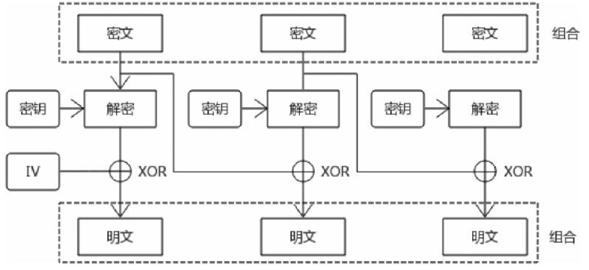
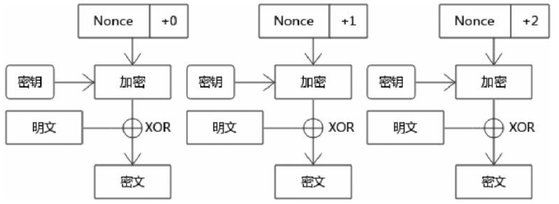
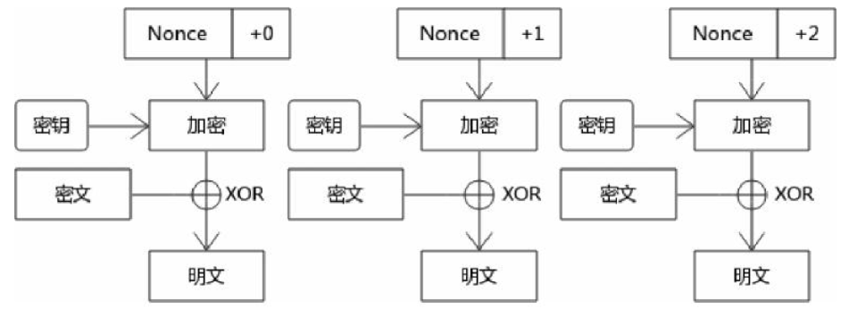
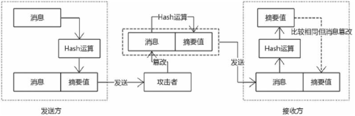
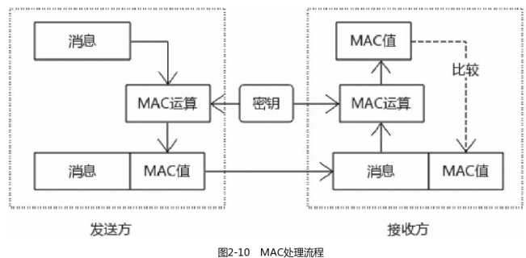

## 第二章 密码学

### Hash算法

### 2.4 对称加密算法

什么是对称加密算法呢？一般是通过一个算法和一个密钥（secret key）对明文（plaintext）进行处理，得到的不规则字符就是密文（ciphertext）。

1. 流密码算法  
   特点
    1. 基于密钥流的异或运算
    2. 连续运算，可以并行处理，速度非常快
2. 块密码算法

   **特点**
    1. 块密码算法在运算（加密或者解密）的时候，不是一次性完成的，每次对固定长度的数据块（block）进行处理

   **块密码算法迭代模式**
    1. ECB模式 
       
    2. CBC模式 
       **加密流程**  
         
       与ECB模式相比，该迭代模式多了一个初始化向量IV(Initialization Vector)，初始化向量(该向量不加密)与第一个数据块进行XOR运算，将运算结果进行加密后得到第一个密文分组。
       后续第n模块会与第n-1模块的密文分组进行XOR运算，运算的结果再加密得到第n个分组。第一个模块的前一个密文分组就是初始化向量。将所有密文分组合并组合再一起就是完整的密文。 
       **解密流程**  
         
       总的来说就是密文与对应的密文分组(上一组密文)进行XOR运算进行解密，将得到的所有明文分组组合起来就是最终明文。
    3. CTR模式 
       **加密流程**
         
       与CBC模式相比，数据库分组时**不需要填充处理**。迭代之前需要生成密钥流，每个密钥流都与他之前的密钥流有关联，第一个密钥流就是一个随机值(Nonce)，这个随机值是不加密的。与CBC不同的时，加密过程是
       密钥流和密钥进行加密运算，运算后的值再与明文进行XOR运算得到密文，迭代每个数据块得到最终的密文。  
       **解密流程**  
       
        - 根据随机数生成密钥流，然后把上面的流程再来一边而已
3. 填充标准 PKCS#7 标准  
   根据填充的字节数量进行对应的填充，如果填充的字节长度n是3，填充的值就是030303；如果n是5，那么填充的值就是0505050505，填充值最后一个字节代表的就是实际填充的长度。
   从安全的角度看，初始化向量应该是随机的，不容易预测的，推荐使用随机数生成器生成初始化向量，初始化向量长度等同于分组长度。

### 2.5 消息验证码

一个与Hash算法息息相关的算法，消息验证码算法(MAC)，主要用于避免信息被篡改，因为加密算法不能提供完整性 
信息篡改实例，中间人攻击  
  
特点:

- 证明消息没有被篡改，这和Hash算法类似
- 消息是正确的发送者发送的，也就是说消息是经过验证的
    
  mac算法分类

1. CBC-MAC 加密过程与CBC迭代模式一样，只不过最后一组密文用来当作消息
2. HMAC（Hash-based Message Authentication Code） 实际应用较多，HTTP中也进行了应用。

#### 2.5.5 AD加密模式

使用者结合对称加密算法和MAC算法，提供机密性和完整性的模式也叫作Authenticated Encryption（AE）加密模式，主要有三种，分别是E&M、MtE、EtM。（E: Encrypt, M: MAC）

#### 2.5.6 AEAD加密模式

与AD不同的是，这里组合了MAC和加密运算，也有三种模式

### 2.6 公开密钥算法（非对称加密算法）

**特点** 
与对称加密相比：速度慢，用途广，密钥分为公钥和私钥

#### 2.6.1 RSA内部结构

1. 生成过程 
   挺复杂的，依赖数学知识
2. 加密解密过程 
   没看明白
3. 算法安全性 
   主要是幂运算和模运算，即离散对数模型，只要密钥长度足够大，安全性还是比较高的