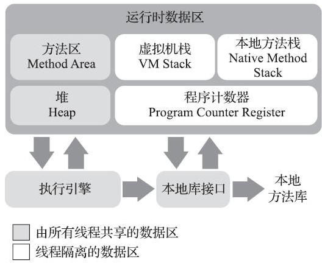

## 第二章 Java内存区域与内存溢出异常
### 运行时内存区域


1. 程序计数器  
选取下一条需要执行的字节码指令，通常用来控制循环、跳转、异常处理、线程恢复。  
每个线程有独立的程序计数器，该区域是线程私有的，互不影响。
2. Java虚拟机栈  
线程私有，虚拟机栈描述的是Java方法执行的线程内存模型：每个方法被执行的时候，Java虚拟机都会同步创建一个栈帧（Stack Frame）用于存储局部变量表、操作数栈、动态连接、方法出口等信息。每一个方法被调用直至执行完毕的过程，就对应着一个栈帧在虚拟机栈中从入栈到出栈的过程。  
**定位CPU占用过多的问题**  
 ```在linux下使用top命令查看进程，然后使用ps命令查看具体的线程，然后调用jstack找到有问题的线程进行分析。```  
**排查死锁问题**
3. 本地方法栈  
HotSpot虚拟机中，本地方法栈和虚拟机栈是合二为一的。
4. Java堆  
内存最大的一块区域，线程共享，用来存放对象实例。是可扩展的（通过参数-Xmx和-Xms设定）。当内存用完并无法扩展时会抛出OOM异常   
**分析工具**
jmap, jconsole, jvisualvm
5. 方法区  
线程共享，它用于存储已被虚拟机加载的类型信息、常量、静态变量、即时编译器编译后的代码缓存等数据。也会抛出OOM异常。
6. 运行时常量池  
是方法区的一部分，Class文件中除了有类的版本、字段、方法、接口等描述信息外，还有一项信息是常量池表（Constant Pool Table），用于存放编译期生成的各种字面量与符号引用，这部分内容将在类加载后存放到方法区的运行时常量池中。  
运行时常量池相对于Class文件常量池的另外一个重要特征是具备动态性，Java语言并不要求常量一定只有编译期才能产生，也就是说，并非预置入Class文件中常量池的内容才能进入方法区运行时常量池，运行期间也可以将新的常量放入池中，这种特性被开发人员利用得比较多的便是String类的intern()方法。  
会抛出OOM异常
7. 直接内存  
例如NIO中分配的堆外内存
   
### HotSpot虚拟机对象
#### Java对象的创建过程
1. 类检查阶段  
检查new指令的参数能否定位到一个类的符号引用，并检查这个符号引用代表的类是否已经被加载，如果没有，则需要先执行类加载过程。
2. 为新对象分配内存  

